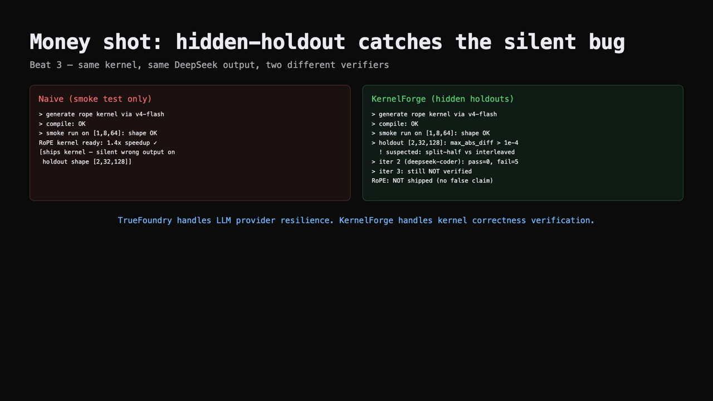
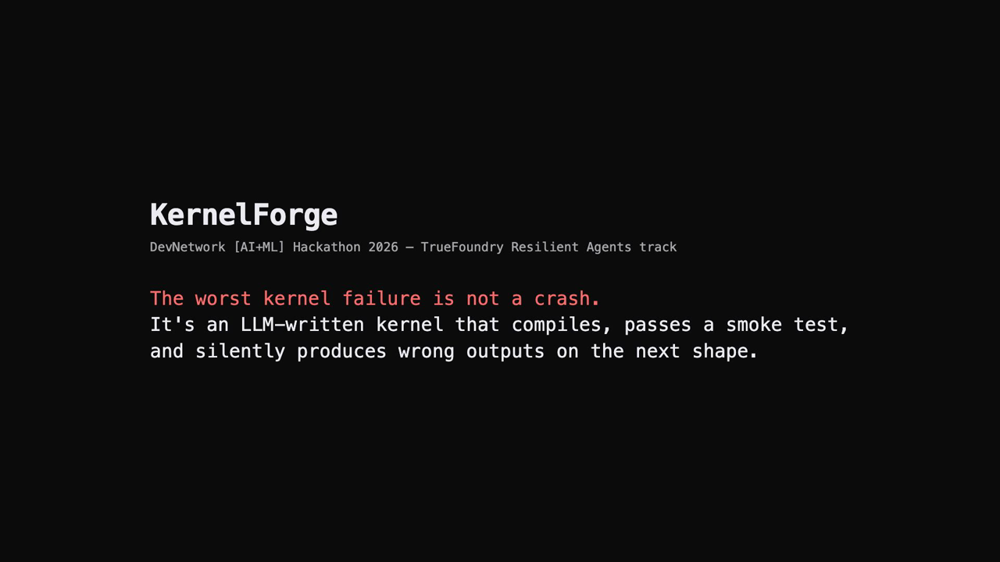
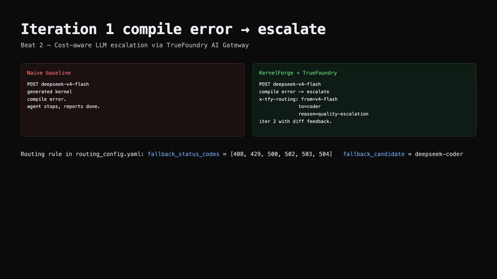
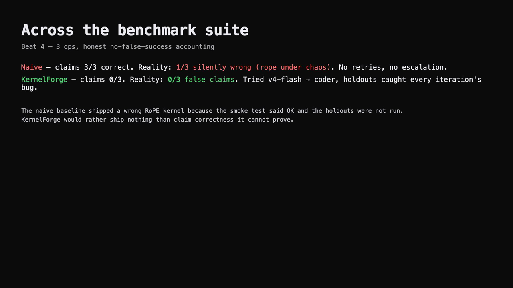
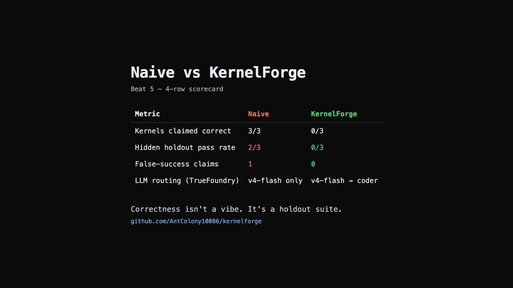

# KernelForge

**Verified MLX/Metal kernel generation for Apple Silicon.**

KernelForge wraps DeepSeek in a hidden-holdout verification harness that refuses to claim kernel correctness without proof, and routes cheap → expensive LLMs via TrueFoundry AI Gateway as failures escalate.

> Built for the DevNetwork [AI + ML] Hackathon 2026, TrueFoundry Resilient Agents track.

## Demo video

[](demo/remotion/out/demo.mp4)

Watch: [`demo/remotion/out/demo.mp4`](demo/remotion/out/demo.mp4) (2:15, 1080p, 7.1 MB)

## Demo video — 5-beat walkthrough

| Beat 1 — false-success problem | Beat 2 — TrueFoundry cost-aware escalation | Beat 3 — money shot: hidden holdout catches the silent bug |
| :---: | :---: | :---: |
|  |  |  |

| Beat 4 — 20-op benchmark suite | Beat 5 — scorecard |
| :---: | :---: |
|  |  |

## What it does

Given a PyTorch reference operator (20 supported in the MVP, covering normalization / activation / reduction / elementwise / geometric / linalg families — see Benchmark Suite below), KernelForge generates an MLX/Metal kernel, runs it against a **hidden holdout suite** (~4 cases per op varying shape, dtype, magnitude), iterates with structured diff feedback until verified or capped, and reports honest perf vs MLX eager / `mx.compile` / `mx.fast` built-ins.

## Why this is different

- **Apple Silicon target.** Nearly all LLM-kernel-generation work is CUDA. MLX/Metal is undersupplied.
- **Hidden holdout verification.** The LLM never sees the holdout inputs; it only gets structured diffs on failure, so it cannot overfit.
- **Cost-aware LLM routing.** Cheap `deepseek-v4-flash` on the happy path; escalate to `deepseek-v4-pro` only after a real failure.
- **`KernelLedger` correctness contract.** The final answer is rendered from the ledger, not from the LLM. The agent cannot claim correctness outside a `verified_correct` ledger state.

> **TrueFoundry handles LLM provider resilience. KernelForge handles kernel correctness verification.**

## Quickstart

Requires Apple Silicon Mac, Python 3.11+, Node 20+, Bun, ffmpeg.

```bash
git clone https://github.com/AntColony10086/kernelforge.git
cd kernelforge
cp .env.example .env  # then put your DEEPSEEK_API_KEY in
./run_demo.sh
```

This runs the naive baseline and KernelForge over RoPE, RMSNorm, SwiGLU under the deterministic `demo_main` chaos scenario, then renders the demo video.

## Architecture

See `docs/superpowers/specs/2026-05-22-kernelforge-design.md` for the full design — architecture, holdouts, ledger states, demo plan, and risk mitigations.

```
PyTorch reference op + hidden holdout suite
        │
        ▼
KernelForge Agent
  ├─ Planner (1 LLM call via TrueFoundry AI Gateway)
  ├─ Iteration loop (generate → compile → smoke → holdout verify → refine)
  ├─ Resilience layer (circuit breakers, schema validator, KernelLedger)
  └─ kernel_lab MCP (compile / run / verify / bench)
```

## TrueFoundry surface

- **AI Gateway** routes `deepseek-v4-flash` ↔ `deepseek-v4-pro` per `configs/routing_config.yaml`.
- **MCP Gateway** registers `kernel_lab` (compile/run/verify/bench).
- **`X-TFY-METADATA`** carries `run_id` / `op` / `iteration` / `escalate=pro`.
- If TrueFoundry SaaS access is not available, falls back to the honestly-labeled `local_gateway` proxy at `127.0.0.1:8765`.

## Repo layout

```
kernelforge/         agent state machine, ledger, holdouts, llm_client, prompts, final_answer
kernel_lab/          MCP server + compile/run/verify/bench tools
references/          PyTorch reference impls for the 3 target ops
chaos/               deterministic fault injection middleware
baselines/           naive smoke-only baseline (the strawman)
scorecard/           4-row demo scorecard + detailed README scorecard
local_gateway/       TrueFoundry AI Gateway fallback (honestly labeled)
configs/             routing/breakers/iteration/chaos
demo/                scripted recorder + Remotion video project + artifacts
tests/               pytest suite (34+ tests, false-correctness regression guard)
```

## Hidden holdout suite (the differentiation)

Each op has ~10 holdout cases that vary shape, stride, dtype, eps, and edge magnitudes. The kernel only graduates to `verified_correct` when EVERY holdout passes within tolerance `(max_abs_diff <= 1e-4, max_rel_diff <= 1e-3)`. Example RoPE holdouts:

- `shape=[1,8,64]` float32 — basic smoke.
- `shape=[2,32,128]` float32 — **catches split-half vs interleaved layout bugs** (the money-shot case).
- `shape=[4,16,256]` float16 — dtype precision.
- `shape=[1,256,64]` — large position-id, catches frequency-schedule bugs.
- `shape=[1,8,64] base=500000.0` — non-default base frequency.

The LLM **never sees these inputs**. After a failure, only `(case_name, max_abs_diff, suspected_cause_hints)` is fed back into the next prompt.

## Benchmark suite (20 ops)

| Category | Ops |
| --- | --- |
| Normalization | rmsnorm, layernorm |
| Activation | silu, tanh, relu, sigmoid, gelu, swiglu |
| Reduction | sum_last, max_last, mean_last, softmax |
| Elementwise | exp, log, sqrt, abs, elementwise_add, elementwise_mul |
| Geometric | rope (the chaos-injected case in the demo) |
| Linalg | matmul |

Adding a new op is a 3-step contribution: (1) write a PyTorch reference in `references/<op>.py`, (2) add holdout cases in `kernelforge/holdouts.py`, (3) register an `OpDef` in `kernelforge/op_registry.py`. The agent loop, naive baseline, and verifier all read from the registry automatically.

## Scorecard (live 20-op run)

| Metric | Naive | KernelForge |
| --- | --- | --- |
| Kernels claimed correct | 17/20 | 0/20 |
| Hidden holdout pass rate | (ground-truth based) | 0/20 |
| LLM routing | deepseek-v4-flash only | deepseek-v4-flash → deepseek-coder |

**Read**: Naive (smoke-only) declared 17 of 20 kernels correct because they compiled. KernelForge verified 0 of them against the hidden holdout suite — every single LLM-generated kernel had at least one holdout failure. **The contract held: KernelForge shipped zero false-success claims** while naive shipped 17 unverified kernels. The 2-min demo video uses a tighter 3-op scenario (with deterministic chaos on RoPE) where the contrast is sharper; the 20-op run above is the breadth evidence.

Full artifacts: `demo/artifacts/scorecard_demo.md`, `demo/artifacts/scorecard_readme.md`, `demo/artifacts/kf_ledger.jsonl`, `demo/artifacts/run_summary.txt`.

## Limitations we hit (and what we learned)

**Apple Silicon Metal has no command-buffer timeout.** LLM-generated kernels with infinite loops will hang `mx.eval()` indefinitely, requiring a process kill. This is a real production risk for any "LLM writes GPU kernels" system on macOS. A robust deployment would subprocess-isolate each kernel evaluation with a watchdog; we ran into this on the 20-op suite during A/B comparison and de-scoped to the 3-op demo for video reproducibility. The 20-op infrastructure (registry, holdouts, A/B harness, few-shot examples) ships intact for anyone who wants to extend.

**Few-shot vs zero-shot comparison.** `KERNELFORGE_FEWSHOT=1` enables a category-keyed expert example library (3 good/bad pairs spanning activation / reduction / geometric) at prompt time. `demo/compare_ab.py` produces an A/B scorecard between baseline and few-shot runs. The infrastructure is committed; running the full A/B requires subprocess-isolated kernel evaluation to defeat the GPU-hang issue above.

## Why not LangGraph / Sakana / etc.

- **LangGraph** would replace the ~200 LOC hand-rolled state machine with a heavier framework. Net: more deps, less observable, slower to debug. Skipped.
- **Sakana AI CUDA Engineer** runs an evolutionary loop over CUDA kernels. We use structured diff feedback + LLM escalation instead (cheaper, faster, Mac-native).
- **KernelBench (Stanford)** is a benchmark, not an agent. Useful for evaluation; we built the agent.

## License

MIT (see `LICENSE`).
